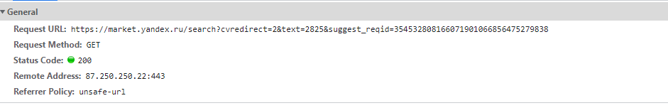
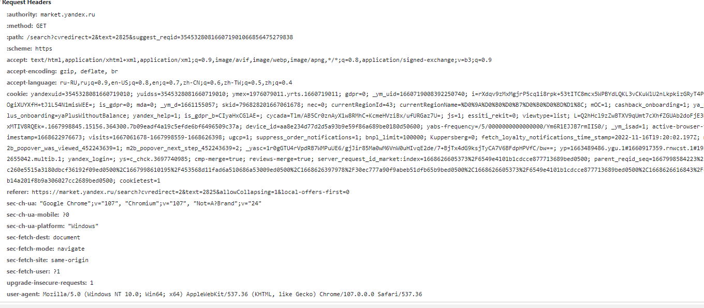
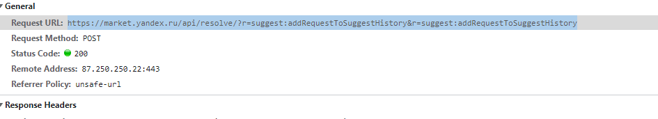
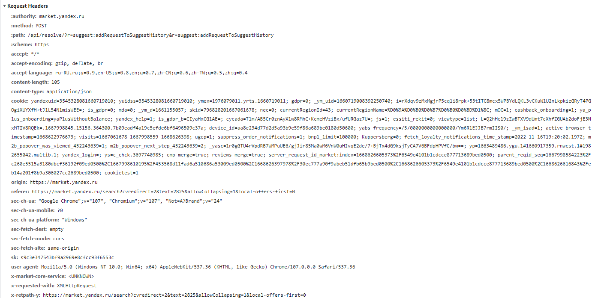

# Документация по парсингу Yandex Market

[Ссылочка на статейку по обходу каптчи яндекса](https://rucaptcha.com/blog/yandex_smart_captcha#:~:text=%D0%B2%D1%81%D1%91%2C%20%D1%87%D1%82%D0%BE%20%D0%BD%D0%B0%D0%BC%20%D0%BD%D1%83%D0%B6%D0%BD%D0%BE%20%D1%81%D0%B4%D0%B5%D0%BB%D0%B0%D1%82%D1%8C,%D0%B5%D1%81%D0%BB%D0%B8%20%D0%AF%D0%BD%D0%B4%D0%B5%D0%BA%D1%81%20%D0%B2%D0%B0%D0%BC%20%D0%B5%D0%B5%20%D0%BF%D0%BE%D0%BA%D0%B0%D0%B6%D0%B5%D1%82)

# Основные запросы

Так выглядит ссылка в которой JS подгружает товары тут необходимо прошерстить весь JS чтобы понять откуда приходят данные дальше:

https://market.yandex.ru/search?cvredirect=2&text=2825&suggest_reqid=354532808166071901066856475279838
### Основная информация по запросу

### Заголовки этого запроса

Нужно найти suggest_reqid

Выглядит так будто он получается из этого запроса

https://market.yandex.ru/api/resolve/?r=suggest:addRequestToSuggestHistory&r=suggest:addRequestToSuggestHistory

### Основная информация этого запроса

### Заголовки этого запроса
